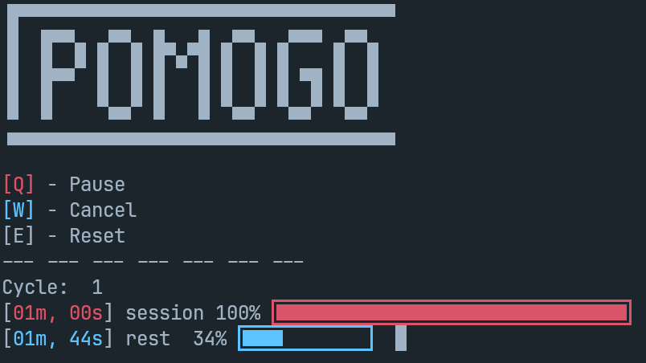

# Pomogo
A pomodoro cli-app made in **Go**. I'm tired of using pomodoro web-app because it needs internet connection. I built pomogo for offline scenario.



# Installation (LINUX) ⚡
### Requirements
1. Get, [download](https://go.dev/) and install **Go**. Version `1.24` or higher is required.
2. Second, make sure you already installed `make`

Clone the repo and build the source file using `make`
```
git clone https://github.com/timocheu/pomogo.git
cd Pomogo
make
```
# Flags/Options :wrench:
> You can use **lowercase** for commands

Set session duration in minutes (default: 25mins)
```
pomogo --session=10 
```

Set rest duration in minutes (default: 5mins)
```
pomogo --rest=15 
```

Set cycles or how many times you want the session to run (default: 1)
```
pomogo --cycle=4 
```
**Example usage**, you can use shorthand argument.
```o
pomogo -s=40 -r=10 -c=2
```

# License
Pomogo is under **MIT license**. Permission is herby granted, free of charge, to any person obtaining a copy of this software and associated documentation files.
